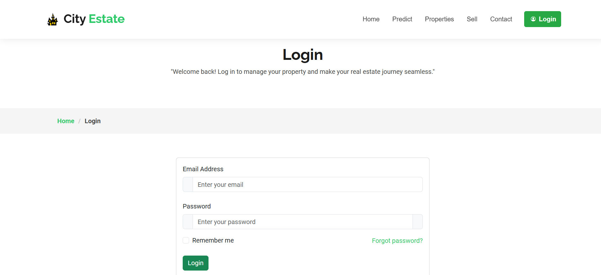

# House Price Prediction System

This project is a House Price Prediction System developed to estimate property prices in Nepal using Decision Tree and Support Vector Machine (SVM) algorithms. Leveraging historical property data, the system provides accurate price predictions based on user-inputted property details.

## Features

- **Accurate Predictions:** Utilizes Decision Tree and SVM algorithms to provide reliable house price estimates.
- **User-Friendly Interface:** Allows users to input property details effortlessly and receive instant predictions.
- **Secure Authentication:** Ensures user data protection through integrated authentication mechanisms.
- **City and Road Type Specific:** Supports property data from Kathmandu, Lalitpur, and Bhaktapur, with road types categorized as blacktopped, graveled, and soil stabilized.

## Installation

1. **Clone the Repository:**
   ```bash
   git clone https://github.com/Dipendra-adk/7thSemProject.git
2. **Navigate to the Project Directory:**
   ```bash
   cd 7thSemProject/homePricePredictior
3. **Install Dependencies:**
   ```bash
   pip install -r requirements.txt
4. Set Up the Database:
   * Ensure PostgreSQL is installed and running.
   * Create a database named homedb.
     ```bash
     DATABASES = {
       'default': {
           'ENGINE': 'django.db.backends.postgresql',
           'NAME': 'homedb',
           'USER': 'postgres',
           'PASSWORD': 'admin',
           'HOST': 'localhost',
           'PORT': '',           
       }
     }
   * Apply migrations:
     ```bash
     python manage.py migrate
5. Run the Development Server:
   ```bash
   python manage.py runserver

## Usage
* Register or Log In: Create an account or log in with existing credentials.
* Input Property Details: Enter information such as area in aana, number of floors, road width (in feet), city, and road type.
* Get Predictions: Receive estimated house prices based on the provided details.
* Compare Results: View and compare predictions from both Decision Tree and SVM models.

## Screenshots
### Login/Signup


## Technologies Used
* Backend: Django
* Frontend: HTML, CSS, JavaScript
* Database: PostgreSQL
* Machine Learning: scikit-learn

## Contributors
   * [Dipendra Adhikari](https://github.com/Dipendra-adk)
   * [Pursottam Bhandari](https://github.com/pursottam1234)
   * [Phanendra Jaisi](https://github.com/phanindraspk)
